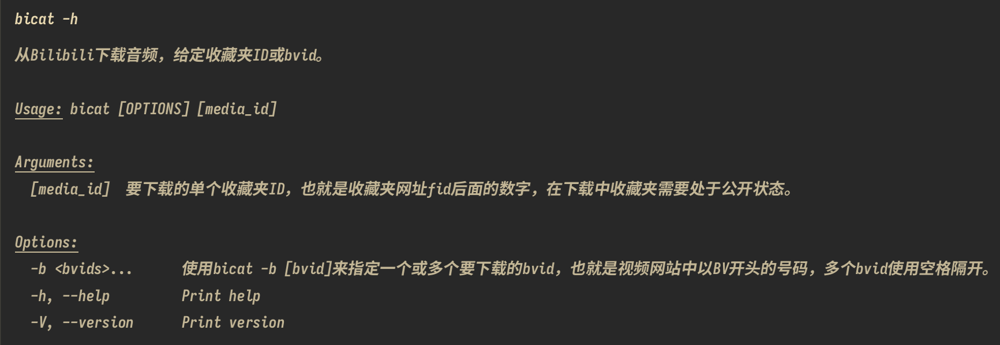
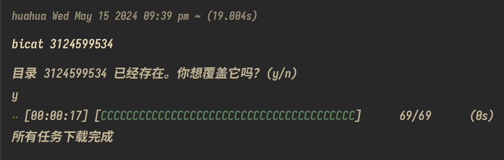
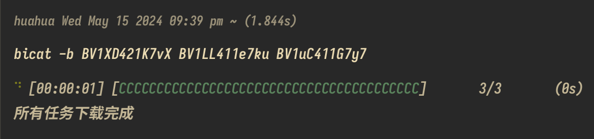
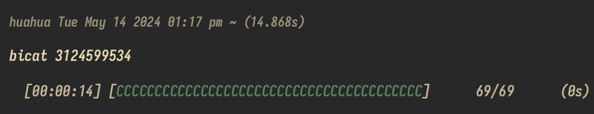

中文版 | [English](README_en.md)

<p align="center">
    
</p>
<h1 align="center">biCat</h1>

# 简介
biCat 是一个基于 tokio 的命令行工具，用于快速下载 bilibili 视频的音频文件，无需登录（目标收藏夹需要在下载的时候公开）

# 安装说明
  - 如果安装遇到网络问题可以使用[gitee](https://gitee.com/huahuadeliaoliao/biCat)

## Linux

### Debian/Ubuntu
  - 可直接下载[release](https://github.com/huahuadeliaoliao/biCat/releases)页面中提供的deb进行安装

### Other
  - 使用以下命令安装 biCat，这会将bicat二进制可执行文件（仅支持linux amd64）放入到当前用户的./local/bin目录当中：
```bash
curl -s https://raw.githubusercontent.com/huahuadeliaoliao/biCat/main/installation_script/install_bicat.sh | bash
```

## Windows
  - 在PowerShell环境中使用以下命令安装，这会将bicat.exe下载到当前用户的AppData\Programs目录下，并加入到环境变量当中：
```powershell
Invoke-WebRequest -Uri https://raw.githubusercontent.com/huahuadeliaoliao/biCat/main/installation_script/install_bicat.ps1 -OutFile install_bicat.ps1; Set-ExecutionPolicy -ExecutionPolicy Bypass -Scope Process -Force; .\install_bicat.ps1
```

## MacOS
  - 使用以下命令安装 biCat，这会将bicat二进制可执行文件（支持aarch64和x86）放入到当前用户的./local/bin目录当中：
```bash
curl -s https://raw.githubusercontent.com/huahuadeliaoliao/biCat/main/installation_script/install_bicat.sh | bash
```

# 版本历史
## 正式版 0.1.0
- [版本信息](https://github.com/huahuadeliaoliao/biCat/releases/tag/v0.1.0)
- 功能改进：
  - 1.加入使用一个或多个bvid下载功能，
  - 2.输出更简洁清晰的错误信息，
  - 3.现在根据收藏夹id下载的音频会放入到一个收藏夹id同名的文件夹当中，
  - 4.加入清理临时文件功能，如果下载中遇到网络错误或者人为中断会清除未下载完成的临时文件以保证下载成功的文件都是完整的，
  - 5.目前可以使用命令在不同平台上更方便的安装bicat。

- **使用示例**
  - 使用 bicat -h 获取使用说明：

    
  - 根据收藏夹id下载：

    
  - 根据bvid下载（可使用多个bvid）：
  
    

<details>
<summary>历史版本</summary>

## Beta 0.1.0
- [版本信息](https://github.com/huahuadeliaoliao/biCat/releases/tag/v0.1.0-beta)
- 初步功能：
  - 实现了从收藏夹下载音频的基本功能，
  - 提供基础的进度显示和错误信息，
  - 仅打包了 deb 和 exe 文件格式。
- 主要功能:
  - **下载收藏夹视频的音频文件**：根据 Bilibili 收藏夹的 media_id（即网址中 fid 后的数字）下载所有视频的音频文件到当前目录，文件名格式为“视频标题-视频作者名.mp3”。
  - **进度显示**：显示下载进度条，包括已完成的任务数和预估剩余时间。
  - **示例**：

    

</details>

# 使用说明
本工具仅供个人学习和研究使用，请勿用于任何商业目的。下载内容请在合法期限内删除，尊重并维护原作者的版权。
