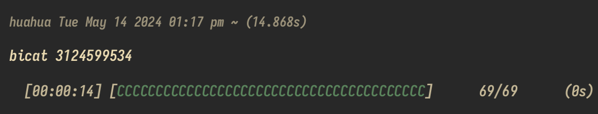

# Introduction
A very fast command line tool to download audio files from bilibili videos, based on tokio, no login required (target favorites need to be public at the time of download).

## Version
Beta 0.1.0 (the function of downloading audio from favorites has been implemented, so it can be used directly, but the error message is very simple, and the function is only implemented to download bicat [media_id], so it is only packaged with deb for the time being)

### Main functions
- **Download audio files of favorite videos**: download audio files of all videos from Bilibili's specified favorite media_id (that is, the number after the fid of the web favorite URL) to the current directory, and save them as video title-video author name.mp3.
- **Progress Display**: displays a progress bar for the download, including the number of tasks completed and the estimated time remaining.
- **Example**:

  

# Instructions for use
The tool is only for personal learning use, please do not use for any commercial purposes, download the content please delete in a timely manner, respect the copyright of the original author!