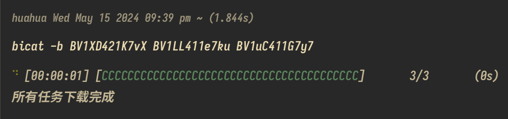

# Introduction
biCat is a tokio-based command line tool for quickly downloading audio files from bilibili videos without logging in (the target favorites to be downloaded must be public).

# Installation

## Linux

### Debian/Ubuntu
  - Installation can be done by downloading the deb provided on the [release](https://github.com/huahuadeliaoliao/biCat/releases) page.

### Other
  - Use the following command to install biCat, which will put the bicat binary executable (linux amd64 only) into the current user's . /local/bin directory:
```bash
curl -s https://raw.githubusercontent.com/huahuadeliaoliao/biCat/main/installation_script/install_bicat.sh | bash
```

## Windows
  - Using the following command in a PowerShell environment will download bicat.exe to the current user's AppData\Programs directory and add it to the environment variables:
```powershell
Invoke-WebRequest -Uri https://raw.githubusercontent.com/huahuadeliaoliao/biCat/main/installation_script/install_bicat.ps1 -OutFile install_bicat.ps1; Set-ExecutionPolicy -ExecutionPolicy Bypass -Scope Process -Force; .\install_bicat.ps1
```

## MacOS
  - For the time being, you can only download the source code and compile the binaries yourself and put them in the executable directory.

## Version history
## Official version 0.1.0
- [Version Information](https://github.com/huahuadeliaoliao/biCat/releases/tag/v0.1.0)
- Functionality improvements:
  - 1. add the ability to download using one or more bvid.
  - 2. output more concise and clear error messages.
  - 3. Now the audio downloaded according to the favorite id will be put into a folder with the same name as the favorite id.
  - 4. Add the function of cleaning temporary files, if the download encounters network errors or human interruptions, it will clear the temporary files that have not been downloaded to ensure that the downloaded files are complete.
  - 5. Now you can use commands to install bicat on different platforms more conveniently.

- **Usage Example
  - Use bicat -h to get instructions:

    
  - Download according to favorite id:

    
  - Download based on bvid (multiple bvids can be used):

    

<details
<summary>Historical Versions</summary>

## Beta 0.1.0
- [Version Information](https://github.com/huahuadeliaoliao/biCat/releases/tag/v0.1.0-beta)
- Preliminary features:
  - Implemented the basic function of downloading audio from favorites.
  - Provides basic progress display and error messages.
  - Only deb and exe files are packaged.
- Main Functions.
  - **Download audio files of favorite videos**: download audio files of all videos to current directory according to media_id of Bilibili favorites (i.e. the number after fid in the url), the file name format is "video_title-video_author_name.mp3".
  - **Progress Display**: displays the download progress bar, including the number of completed tasks and estimated remaining time.
  - **Example**:

    

</details

# Instructions for use
This tool is for personal study and research only, please do not use it for any commercial purpose. Please delete the downloaded content within the legal period to respect and maintain the copyright of the original author.